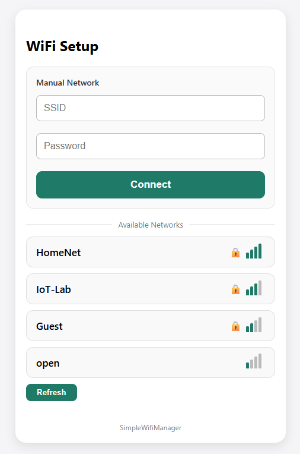

# SimpleWifiManager

SimpleWifiManager is a small, easy-to-use WiFi manager library for ESP32 (Arduino framework). It provides automatic reconnect, persistent credential storage, and a captive-portal fallback (Access Point + configuration page) when no saved network is available.

The Library is validated with arduino-esp32 3.3.7

**Goal**

This library is designed to be  small and simple — minimal RAM/flash footprint, no unnecessary dependencies. The API is intentionally tiny so it is easy to integrate into any project.

**Features**

- **Automatic STA connection:** Connects to saved SSID/password and supports automatic reconnects.
- **AP / Captive Portal fallback:** Starts an access point with a captive portal for network configuration when no credentials are saved or the connection is lost.
- **Non-blocking operation:** Runs asynchronously in the background without blocking the main loop.
- **Persistent storage:** Saves SSID and password using `Preferences` (non-volatile storage).
- **Compact captive UI:** Includes embedded captive portal page with a simple form to enter WiFi credentials.
- **Configurable:** Adjust timeouts, retry intervals and captive portal title.

**Quickstart (Arduino)**

1. Add the library to your PlatformIO/Arduino project and `#include "SimpleWifiManager.h"`.
2. In `setup()`: `SimpleWifiManager swm; swm.begin("MyAP");`
3. Optional: `swm.customize("My Device WiFi");`, `swm.setTimeout(15000);`

Example:

```cpp
#include "SimpleWifiManager.h"

SimpleWifiManager swm;

void setup() {
	swm.begin("Setup-AP");
}

void loop() {
	// The library manages connectivity asynchronously
}
```



**Key API (short)**

- `begin(const char *apName = "WiFi-Setup")` — Starts the manager; attempts STA connection or starts AP.
- `customize(const char* title)` — Sets the title shown in the captive portal.
- `stop()` — Stops the manager, shuts down AP/server and releases resources.
- `setTimeout(uint32_t timeoutMs)` — Connection timeout for STA attempts.
- `setOfflineTimeout(uint32_t timeoutMs)` — Time to wait while offline before falling back to AP.
- `setRetryInterval(uint32_t intervalMs)` — Interval between STA retry attempts.
- `resetCredentials()` — Clears stored SSID/passwords.

**Supported hardware**

- ESP32 (Arduino core)


**Gzip compressed captive page (default)**

The captive portal is served gzipped by default to minimize flash usage. If you prefer to serve the uncompressed/minified HTML instead, disable gzip at build time by defining `SWM_DISABLE_GZIP`.

How to disable gzip:
- Arduino IDE: add `#define SWM_DISABLE_GZIP` above the `#include "SimpleWifiManager.h"` in your sketch.
- PlatformIO: add the build flag to `platformio.ini`:

```
[env:your_env]
build_flags = -D SWM_DISABLE_GZIP
```

When gzip is enabled (the default) the library serves the gzipped byte array from `src/CaptivePage.h` with the `Content-Encoding: gzip` header so the browser automatically decompresses it. The generated header contains both variants; the header comment and build flag explain which one is active.

**Development**

The repository includes a small `tools` folder with utilities to help development:

- `tools/convert_html.js`: Node script that minifies `tools/index.html`, gzips it and generates `src/CaptivePage.h` containing both the gzipped and the uncompressed variants. Regenerate the header with:

```bash
node tools/convert_html.js
```

- `tools/server.py`: lightweight development server to preview the captive page locally (requires Python 3). Start it with:

```bash
python tools/server.py
```

**License**

MIT License. See LICENSE file for details.
